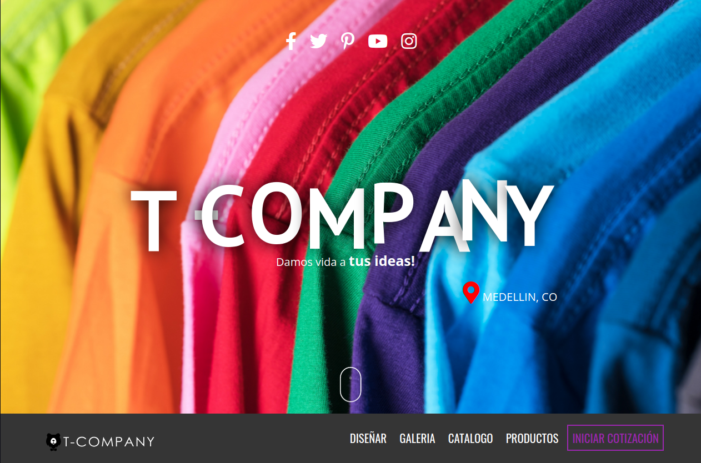

<!--
*** This is a Best-README-Template, your repository is 
*** https://github.com/othneildrew/Best-README-Template
*** If you have a suggestion
*** that would make this better, please fork the repo and create a pull request
*** or simply open an issue with the tag "enhancement".
*** Thanks again! Now go create something AMAZING! :D
***
***
***
*** To avoid retyping too much info. Do a search and replace for the following:
*** github_username, repo_name, twitter_handle, email, project_title, project_description
-->

<!-- PROJECT SHIELDS -->
<!--
*** I'm using markdown "reference style" links for readability.
*** Reference links are enclosed in brackets [ ] instead of parentheses ( ).
*** See the bottom of this document for the declaration of the reference variables
*** for contributors-url, forks-url, etc. This is an optional, concise syntax you may use.
*** https://www.markdownguide.org/basic-syntax/#reference-style-links
-->
[![uses-html][html-shield]][learnhtml-url]
[![uses-css][css-shield]][learncss-url]
[![uses-js][js-shield]][learnjs-url]
[![uses-php][php-shield]][learnphp-url]
[![MIT License][license-shield]][license-url]
[![LinkedIn][linkedin-shield]][linkedin-url]

<!-- PROJECT LOGO -->
 

  

  <h3 align="center">T-Company</h3>

  

    Proyecto Tienda Online TCompany.tda
     
    <a href="https://github.com/JasRockr/TCompany/tree/master/T-Company_PHP"><strong>Estos los documentos »</strong></a>
     
     
    <a href="https://github.com/JasRockr/TCompany">View Demo</a>
    ·
    <a href="https://github.com/JasRockr/TCompany/issues">Report Bug</a>
    ·
    <a href="https://github.com/JasRockr/TCompany/issues">Request Feature</a>
  

<!-- PROJECT INDEX -->

[Version de pruebas publicada, sigue en desarrollo.](http://jsonrivera.tk)

<!-- TABLE OF CONTENTS -->

  
<h2 style="display: inline-block">Tabla de Contenidos</h2>

  <ol>
    <li>
      <a href="#about-the-project">Sobre el proyecto</a>
      <ul>
        <li><a href="#built-with">Tecnologias usadas</a></li>
      </ul>
    </li>
    <li>
      <a href="#getting-started">Getting Started</a>
      <ul>
        <li><a href="#prerequisites">Prerequisites</a></li>
        <li><a href="#installation">Installation</a></li>
      </ul>
    </li>
    <li><a href="#usage">Usage</a></li>
    <li><a href="#roadmap">Roadmap</a></li>
    <li><a href="#contributing">Contributing</a></li>
    <li><a href="#license">License</a></li>
    <li><a href="#contact">Contact</a></li>
    <li><a href="#acknowledgements">Acknowledgements</a></li>
  </ol>

<!-- ABOUT THE PROJECT -->
## About The Project

Actualmente es para uso academico y sigue en desarrollo, hay archivos pendientes por depurar y sobrecargan el proyecto.

Here's a blank template to get started:
**To avoid retyping too much info. Do a search and replace with your text editor for the following:**
`JasRockr`, `TCompany`, `@JasRockr`, `jasrockr@hotmail.com`, `TCompany_Project`, `Project Store TCompany.tda`

### Built With

* [HTML]()
* [CSS]()
* [JS]()
* [PHP]()
* [MYSQL]()

<!-- GETTING STARTED -->
## Getting Started

Actualmente no hay una version en funcionamiento.

### Prerequisites

N/A

### Installation

N/A

<!-- USAGE EXAMPLES -->
## Usage

Actualmente es para uso de proyecto academico.

_For more examples, please refer to the [Documentation](https://example.com)_

<!-- ROADMAP -->
## Roadmap

See the [open issues](https://github.com/JasRockr/TCompany/issues) for a list of proposed features (and known issues).

<!-- CONTRIBUTING -->
## Contributing

Contributions are what make the open source community such an amazing place to be learn, inspire, and create. Any contributions you make are **greatly appreciated**.

1. Fork the Project
2. Create your Feature Branch (`git checkout -b feature/AmazingFeature`)
3. Commit your Changes (`git commit -m 'Add some AmazingFeature'`)
4. Push to the Branch (`git push origin feature/AmazingFeature`)
5. Open a Pull Request

<!-- LICENSE -->
## License

Distributed under the MIT License. See `LICENSE` for more information.

<!-- CONTACT -->
## Contact

Your Name - [@JasRockr](https://twitter.com/@JasRockr) - jasrockr@hotmail.com

Project Link: [https://github.com/JasRockr/TCompany](https://github.com/JasRockr/TCompany)

<!-- ACKNOWLEDGEMENTS -->
## Acknowledgements

* 
* 
* 

<!-- MARKDOWN LINKS & IMAGES -->
<!-- https://www.markdownguide.org/basic-syntax/#reference-style-links -->
[html-shield]: https://img.shields.io/badge/uses-HTML-orange
[learnhtml-url]: https://www.w3schools.com/html
[css-shield]: https://img.shields.io/badge/uses-CSS-blue
[learncss-url]: https://www.w3schools.com/css
[js-shield]: https://img.shields.io/badge/uses-JS-yellow
[learnjs-url]: https://www.w3schools.com/js
[php-shield]: https://img.shields.io/badge/uses-PHP-%238892BF
[learnphp-url]: https://www.w3schools.com/php
[license-shield]: https://img.shields.io/badge/license-MIT-red
[license-url]: ./LICENSE.txt
[linkedin-shield]: https://img.shields.io/badge/-LinkedIn-black.svg?style=for-the-badge&logo=linkedin&colorB=555
[linkedin-url]: https://www.linkedin.com/in/jsonrivera/
