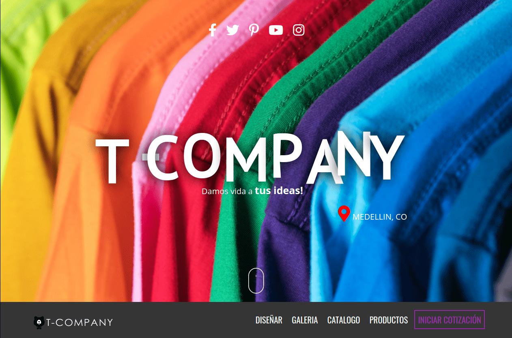

<!--
*** This is a Best-README-Template, your repository is 
*** https://github.com/othneildrew/Best-README-Template
*** If you have a suggestion
*** that would make this better, please fork the repo and create a pull request
*** or simply open an issue with the tag "enhancement".
*** Thanks again! Now go create something AMAZING! :D
***
***
***
*** To avoid retyping too much info. Do a search and replace for the following:
*** github_username, repo_name, twitter_handle, email, project_title, project_description
-->

<!-- PROJECT SHIELDS -->
<!--
*** I'm using markdown "reference style" links for readability.
*** Reference links are enclosed in brackets [ ] instead of parentheses ( ).
*** See the bottom of this document for the declaration of the reference variables
*** for contributors-url, forks-url, etc. This is an optional, concise syntax you may use.
*** https://www.markdownguide.org/basic-syntax/#reference-style-links
-->
[![uses-html][html-shield]][learnhtml-url]
[![uses-css][css-shield]][learncss-url]
[![uses-js][js-shield]][learnjs-url]
[![uses-php][php-shield]][learnphp-url]
[![MIT License][license-shield]][license-url]
[![LinkedIn][linkedin-shield]][linkedin-url]

<!-- PROJECT LOGO -->
 

  

  <h3 align="center">T-Company</h3>

  

    Proyecto Tienda Online TCompany [tda]
     
    <a href="https://github.com/JasRockr/TCompany/tree/master/T-Company_PHP"><strong>Explora los archivos »</strong></a>
     
     
    <a href="http://jsonrivera.tk">Ver una Demo</a>
    ·
    <a href="https://github.com/JasRockr/TCompany/issues">Reporta un error</a>
    ·
    <a href="https://github.com/JasRockr/TCompany/issues">Solicita funciones</a>
  

<!-- PROJECT INDEX -->

<a href="http://jsonrivera.tk">Version de pruebas publicada, sigue en desarrollo</a>

<!-- TABLE OF CONTENTS -->

  
<h2 style="display: inline-block">Tabla de Contenidos</h2>

  <ol>
    <li>
      <a href="#about-the-project">Sobre el proyecto</a>
      <ul>
        <li><a href="#built-with">Tecnologias usadas</a></li>
      </ul>
    </li>
    <li>
      <a href="#getting-started">Requerimientos</a>
      <ul>
        <li><a href="#prerequisites">Navegadores Web</a></li>
        <li><a href="#installation">Instalacion</a></li>
      </ul>
    </li>
    <li><a href="#usage">Guia de usuario</a></li>
    <li><a href="#roadmap">Guia de Navegacion</a></li>
    <li><a href="#contributing">Contribuciones</a></li>
    <li><a href="#license">Licencia</a></li>
    <li><a href="#contact">Contacto</a></li>
    <li><a href="#acknowledgements">Agradecimientos</a></li>
  </ol>

<!-- ABOUT THE PROJECT -->
## Sobre el proyecto

Aplicacion web orientada a una tienda de venta y distribucuin de camisetas personalizadas.

Es un Proyecto Personal que actualmente es para uso academico y sigue en desarrollo, hay archivos pendientes por depurar y que aun sobrecargan el proyecto.

### Tecnologias usadas

* [HTML](https://html.spec.whatwg.org/multipage/)
* [CSS](https://www.w3.org/Style/CSS/)
* [JavaScript](https://developer.mozilla.org/en-US/docs/Web/javascript)
* [jQuery](https://jquery.com/)
* [Ajax](https://developer.mozilla.org/en-US/docs/Web/Guide/AJAX)
* [PHP](https://www.php.net/)
* [MySQL](https://www.mysql.com/)

(<a href="#top">Volver arriba</a>)

<!-- GETTING STARTED -->
## Requerimientos

Actualmente no hay una version en funcionamiento.

### Navegadores Web

La visualizacion y navegacion por el contenido de manera fluida se prueba regularmente con las ultimas versiones del navegador y es compatible con los siguientes:

* Google Chrome
* Mozilla Firefox
* Brave Web Browser
* Opera
* Microsoft Edge
* Safari
* Internet Explorer

(<a href="#top">Volver arriba</a>)

### Instalacion

N/A

(<a href="#top">Volver arriba</a>)

<!-- USAGE EXAMPLES -->
## Guia de usuario

Actualmente continua en desarrollo y no hay una guia completa.

_Para mas detalles, puede consultar la siguiente [Documentacion](https://example.com)_

(<a href="#top">Volver arriba</a>)

<!-- ROADMAP -->
## Guia de Navegacion

Aqui podra ver los [requerimientos abiertos](https://github.com/JasRockr/TCompany/issues) para una lista de las funcionalidades propuestas (y otros problemas conocidos).

(<a href="#top">Volver arriba</a>)

<!-- CONTRIBUTING -->
## Contribuciones

Son las contribuciones lo que permite que la comunidad de codigo abierto sea el mejor lugar para aprender, inspirar, transformar y crear. Cualquiera que sea tu contribucion sera **muy apreciada**.

1. Haz un 'Fork' del Proyecto
2. Crea tu 'Branch' de funcionalidades (`git checkout -b feature/AmazingFeature`)
3. No olvides el 'Commit' de tus cambios (`git commit -m 'Add some AmazingFeature'`)
4. Envialo de vuelta (`git push origin feature/AmazingFeature`)
5. Abre el 'Pull Request'

(<a href="#top">Volver arriba</a>)

<!-- LICENSE -->
## Licencia

Distribuido bajo licencia MIT. Puedes ver el `LICENSE` si quieres saber mas.

(<a href="#top">Volver arriba</a>)

<!-- CONTACT -->
## Contacto

Jay Rivera - [@JasRockr](https://twitter.com/@JasRockr) - jasrockr@hotmail.com

Link al proyecto: [https://github.com/JasRockr/TCompany](https://github.com/JasRockr/TCompany)

(<a href="#top">Volver arriba</a>)

<!-- ACKNOWLEDGMENTS -->
## Agradecimientos

Gracias por interesarte en este proyecto, si lo vas a usar hazlo bien. 

&#128406; &#129492;

(<a href="#top">Volver arriba</a>)

<!-- MARKDOWN LINKS & IMAGES -->
<!-- https://www.markdownguide.org/basic-syntax/#reference-style-links -->
[html-shield]: https://img.shields.io/badge/uses-HTML-orange
[learnhtml-url]: https://www.w3schools.com/html
[css-shield]: https://img.shields.io/badge/uses-CSS-blue
[learncss-url]: https://www.w3schools.com/css
[js-shield]: https://img.shields.io/badge/uses-JS-yellow
[learnjs-url]: https://www.w3schools.com/js
[php-shield]: https://img.shields.io/badge/uses-PHP-%238892BF
[learnphp-url]: https://www.w3schools.com/php
[license-shield]: https://img.shields.io/badge/license-MIT-red
[license-url]: ./LICENSE.txt
[linkedin-shield]: https://img.shields.io/badge/-LinkedIn-black.svg?style=for-the-badge&logo=linkedin&colorB=555
[linkedin-url]: https://www.linkedin.com/in/jsonrivera/
